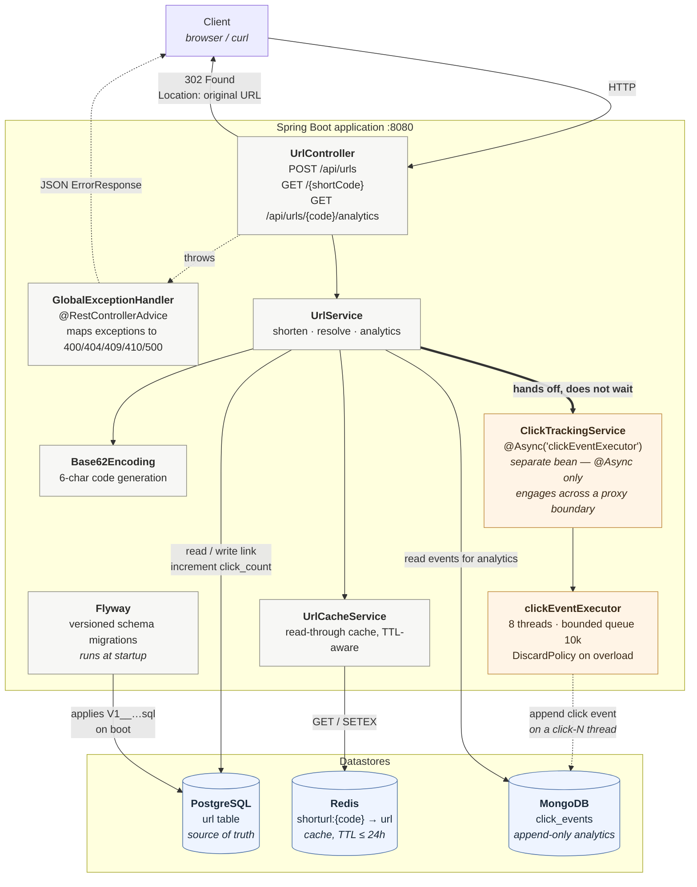
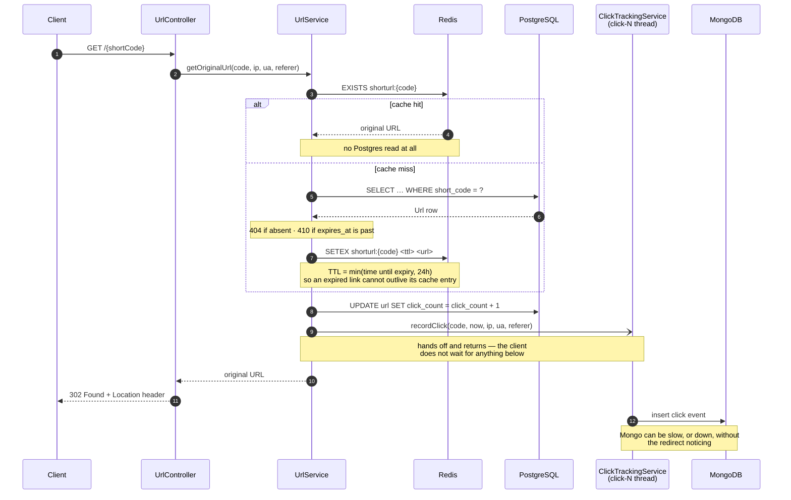

# URL Shortener

A production-shaped URL shortener built with Spring Boot 4 and Java 21, using three
datastores for three different jobs: **PostgreSQL** for the durable link record,
**Redis** for the read-through cache on the redirect hot path, and **MongoDB** for the
append-only stream of click events.

The interesting part of this project isn't shortening a URL — it's that a redirect is a
read-heavy, latency-sensitive operation with a write side-effect, and the three stores
exist to keep those concerns apart.

```bash
git clone https://github.com/raj-kshitiz/Url_Shortener && cd URLShortener
cp .env.example .env          # edit POSTGRES_PASSWORD
docker compose up --build     # app + Postgres + Mongo + Redis
```

Then `curl -X POST localhost:8080/api/urls -H 'Content-Type: application/json' -d '{"originalUrl":"https://example.com"}'`.

---

## Table of contents

- [Architecture](#architecture)
- [Why three datastores](#why-three-datastores)
- [How a redirect works](#how-a-redirect-works)
- [Running it](#running-it)
- [API](#api)
- [Data model](#data-model)
- [Design decisions](#design-decisions)
- [Known limitations](#known-limitations)
- [Roadmap](#roadmap)
- [Project layout](#project-layout)

---

## Architecture



The thick arrow into `ClickTrackingService` is the boundary between what the client
waits for and what it doesn't: everything past it runs on a `click-N` thread after
the `302` has already been sent.

Everything runs from a single `docker compose up`: the application image is built from the
multi-stage `Dockerfile`, and the three datastores come up alongside it with healthchecks,
so the app only starts once they are actually accepting connections.

---

## Why three datastores

This is the question an interviewer will ask, so here is the answer up front.

| Store | What lives there | Why not somewhere else |
|---|---|---|
| **PostgreSQL** | The `url` record: short code, original URL, expiry, click count | The short-code → URL mapping is the one thing that must never be lost or duplicated. It needs a real uniqueness constraint (`uk_url_short_code`), and it needs ACID. |
| **Redis** | `shorturl:{code}` → original URL, TTL-bounded | The redirect is the hot path and it is overwhelmingly reads of a tiny, immutable value. Serving it from Postgres means a network round-trip plus a B-tree lookup for something that never changes. |
| **MongoDB** | One document per click: timestamp, IP, user agent, referer | Click events are high-volume, append-only, never updated, and schema-loose (geolocation is being added, and the shape will keep changing). Putting them in Postgres means unbounded row growth in the same database that serves the hot path. |

The short version: **one store owns correctness, one owns latency, one owns volume.**

---

## How a redirect works



**What the client actually waits for:** the Redis lookup, and one Postgres `UPDATE`. The
click event is handed to a bounded thread pool and the request returns immediately — a
Mongo stall no longer shows up as redirect latency, and a Mongo outage no longer turns a
cacheable redirect into a 500.

**The honest note on what's left:** that `UPDATE` at step 9 is still synchronous, so every
redirect writes to Postgres. It is now the whole of the remaining hot-path cost, and it's
what the Redis `INCR` + `@Scheduled` flush on the [roadmap](#roadmap) removes. Called out
rather than hidden, because knowing where your own bottleneck is matters more than not
having one.

---

## Running it

### Prerequisites

- **Docker** and **Docker Compose** — that is the whole list for the containerized path.
- For running the app outside Docker: **JDK 21** (the Maven wrapper `./mvnw` is included, so no Maven install needed).

### Option A — everything in Docker (recommended)

```bash
git clone <repo-url>
cd URLShortener

# 1. Create your local env file. Nothing secret is committed to this repo;
#    .env is gitignored and .env.example is the template.
cp .env.example .env

# 2. Edit .env and set a real POSTGRES_PASSWORD (it ships as `change_me`).
#    POSTGRES_DB / MONGO_DB / POSTGRES_USER can stay as they are.

# 3. Build the app image and start all four services.
docker compose up --build
```

First run takes a couple of minutes while Maven downloads dependencies inside the build
stage; later builds reuse the cached layer. The app is up when the log shows
`Started URLShortenerApplication`.

| Service | Host address | Notes |
|---|---|---|
| Application | `http://localhost:8080` | |
| PostgreSQL | `localhost:5432` | exposed so you can attach DBeaver / IntelliJ |
| MongoDB | `localhost:27017` | |
| Redis | `localhost:6380` | **6380**, not 6379, to avoid clashing with a local Redis |

Useful commands:

```bash
docker compose logs -f app      # follow application logs
docker compose ps               # health status of every service
docker compose down             # stop; named volumes keep your data
docker compose down -v          # stop and wipe the databases
```

### Option B — databases in Docker, app in your IDE

Handy for debugging with breakpoints.

```bash
cp .env.example .env                              # then edit POSTGRES_PASSWORD
docker compose up -d postgres mongo redis         # infra only, no app container

# The app defaults to Redis on 6379, but compose publishes it on 6380,
# so override the port for the local run:
SPRING_DATA_REDIS_PORT=6380 ./mvnw spring-boot:run
```

`application.yml` imports `.env` via `spring.config.import: optional:file:.env[.properties]`,
so `POSTGRES_DB`, `POSTGRES_USER` and `POSTGRES_PASSWORD` resolve automatically for a local
run. The import is `optional:`, which is why the same file also works inside Docker, where
Compose supplies those values as real environment variables instead (and env vars win).

If you set `SPRING_DATA_REDIS_PORT` in your shell profile or run configuration once, you
can drop the prefix from the command.

### Verify it works

```bash
# Shorten a URL
curl -s -X POST http://localhost:8080/api/urls \
  -H 'Content-Type: application/json' \
  -d '{"originalUrl":"https://spring.io/projects/spring-boot"}'
# → {"shortUrl":"http://localhost:8080/3kFq2a","originalUrl":"…","expiresAt":null}

# Follow the redirect (-I shows the 302 without following it)
curl -I http://localhost:8080/3kFq2a
# → HTTP/1.1 302 · Location: https://spring.io/projects/spring-boot

# Read the analytics back
curl -s http://localhost:8080/api/urls/3kFq2a/analytics
```

**Prove the redirect doesn't depend on Mongo.** This is the async change in one command —
kill the analytics database and watch redirects keep serving:

```bash
docker compose stop mongo
curl -I http://localhost:8080/3kFq2a     # still 302, no added latency
docker compose start mongo
```

The click events for that window are gone — that is the deliberate trade, see
[Design decisions](#design-decisions). The redirect never noticed.

You can also confirm the work really left the request thread: application logs run at
`DEBUG`, and `ClickTrackingService` logs the thread it ran on.

```
Recorded click for 3kFq2a on click-1                   ← async, correct
Recorded click for 3kFq2a on http-nio-8080-exec-1      ← would mean the proxy was bypassed
```

### Configuration reference

| Variable | Used by | Default | Purpose |
|---|---|---|---|
| `POSTGRES_DB` | app + compose | `url_shortener` | Postgres database name |
| `POSTGRES_USER` | app + compose | — | Postgres user |
| `POSTGRES_PASSWORD` | app + compose | — | Postgres password (**set this**) |
| `MONGO_DB` | app + compose | `url_shortener` | Mongo database name |
| `SPRING_DATA_REDIS_HOST` | app | `localhost` | Redis host |
| `SPRING_DATA_REDIS_PORT` | app | `6379` | Redis port — use `6380` for a local run against Compose |
| `APP_BASE_URL` | app | `http://localhost:8080` | Prefix used to build returned short URLs |

No credential is committed anywhere in this repository. `application.yml` contains only
`${PLACEHOLDER}` references; the values come from `.env` locally and from the environment
in Docker.

---

## API

### `POST /api/urls` — create a short URL

```json
{
  "originalUrl": "https://example.com/some/very/long/path",
  "customAlias": "my-link",
  "expiresAt": "2026-12-31T23:59:59Z"
}
```

`originalUrl` is required and validated as a URL. `customAlias` and `expiresAt` are
optional; without an alias, a 6-character Base62 code is generated.

**`201 Created`**

```json
{
  "shortUrl": "http://localhost:8080/my-link",
  "originalUrl": "https://example.com/some/very/long/path",
  "expiresAt": "2026-12-31T23:59:59Z"
}
```

### `GET /{shortCode}` — redirect

Returns **`302 Found`** with the original URL in the `Location` header. Records a click
event and increments the counter. Optional `X-Forwarded-For`, `User-Agent` and `Referer`
headers are captured for analytics.

### `GET /api/urls/{shortCode}/analytics`

**`200 OK`**

```json
{
  "shortUrl": "http://localhost:8080/my-link",
  "originalUrl": "https://example.com/some/very/long/path",
  "createdAt": "2026-08-11T10:00:00Z",
  "expiresAt": "2026-12-31T23:59:59Z",
  "totalClicks": 42,
  "clicks": [
    {
      "timestamp": "2026-08-11T10:05:00Z",
      "ipAddress": "203.0.113.7",
      "userAgent": "Mozilla/5.0 …",
      "referer": "https://news.ycombinator.com/"
    }
  ]
}
```

`totalClicks` is the aggregate counter from Postgres; `clicks` is the per-event detail from
Mongo.

### Errors

Every error returns the same `ErrorResponse` shape — `{ status, message, timestamp }` —
from a single `@RestControllerAdvice`, so clients never have to parse two error formats.

| Status | When |
|---|---|
| `400 Bad Request` | Missing or malformed `originalUrl` (bean validation) |
| `404 Not Found` | Unknown short code |
| `409 Conflict` | Requested custom alias is already taken |
| `410 Gone` | The link existed but has passed its `expiresAt` |
| `500 Internal Server Error` | Anything unhandled — logged server-side, generic message returned |

---

## Data model

**PostgreSQL — `url`** (created by `V1__create_url_table.sql`, applied by Flyway)

| Column | Type | Notes |
|---|---|---|
| `id` | `BIGINT` identity | primary key |
| `short_code` | `VARCHAR(255)` | `NOT NULL`, unique (`uk_url_short_code`) |
| `original_url` | `VARCHAR(2048)` | `NOT NULL` |
| `custom_alias` | `BOOLEAN` | `NOT NULL` — was the code user-supplied |
| `created_at` | `TIMESTAMPTZ` | set by Hibernate `@CreationTimestamp` |
| `expires_at` | `TIMESTAMPTZ` | nullable — null means never expires |
| `click_count` | `INTEGER` | `NOT NULL`, incremented by an atomic `UPDATE` |

Schema changes are versioned SQL files under `src/main/resources/db/migration`, applied by
Flyway on startup. Hibernate runs with `ddl-auto: validate`, so it will refuse to start if
the entity and the migrated schema disagree — it never alters the schema itself.

**MongoDB — `click_events`**

```jsonc
{
  "_id": "…",
  "shortCode": "my-link",     // indexed
  "timestamp": "2026-08-11T10:05:00Z",
  "ip_address": "203.0.113.7",
  "userAgent": "…",
  "referer": "…",
  "location": { "country": null, "city": null }   // geolocation enrichment, in progress
}
```

**Redis**

`shorturl:{shortCode}` → original URL, plain strings, TTL of `min(time until expiry, 24h)`.

---

## Design decisions

**Short codes are random, not sequential.** A counter encoded in Base62 is faster to
generate and guarantees uniqueness for free, but it makes every link enumerable — anyone
can walk the keyspace and read every URL ever shortened. Codes are drawn randomly from
`[62⁵, 62⁶)` so every code is exactly 6 characters, giving ~56 billion possibilities, and
the generator loops until it finds an unused one.

**Expiry is enforced in two places, deliberately.** Postgres holds `expires_at` and the
lookup checks it. But a cached entry never re-reads Postgres, so the cache TTL is capped at
the link's remaining lifetime — an expired link cannot outlive its cache entry. There is
also a guard against a zero or negative TTL: Redis treats a zero TTL as "store forever",
which would turn an expiry into an immortal entry.

**Click events are recorded asynchronously, and may be dropped on purpose.** The redirect
is the product; the click event is telemetry. `ClickTrackingService` lives in its own bean
rather than being a method on `UrlService`, because `@Async` only engages across a Spring
proxy boundary — a self-invocation would compile, start, and silently run synchronously.
The executor is bounded (8 threads, 10,000-deep queue): an unbounded queue would turn a
slow Mongo into an `OutOfMemoryError`. When that queue fills, the policy is `DiscardPolicy`
— events are dropped rather than the default `AbortPolicy`, which throws back into the
calling thread and would return **500s on redirects** because an analytics write couldn't
be queued. `CallerRunsPolicy` would be honest backpressure, but applied to the wrong path:
it makes the request thread do the Mongo write exactly when the system is already
struggling. So the failure mode is chosen: **lose analytics, keep serving redirects.** That
is correct here and would be wrong for anything billable, where the answer is an outbox
table or a broker.

**`@Transactional` moved from the service to the repository.** It used to sit on
`getOriginalUrl`, where it implied the Postgres update and the Mongo insert committed
together. They never did — Mongo isn't a JDBC resource and takes no part in a JDBC
transaction. With the Mongo write now async, the annotation had nothing left to describe,
so it moved down onto `incrementClickCount`, which is a `@Modifying` query and genuinely
requires a transaction. The write got its own short transaction, which is all it ever
actually was.

**Flyway instead of `ddl-auto: update`.** Hibernate's auto-DDL silently mutates the schema
on startup, which is fine on a laptop and unacceptable anywhere else — there is no review,
no rollback, and no record of what changed. Migrations are versioned SQL, and
`ddl-auto: validate` turns a schema drift into a startup failure instead of a runtime
surprise.

**The Docker image is multi-stage and layered.** The build stage carries a full JDK and
Maven; the runtime stage is a JRE only — no compiler, no build tool, no source. The Spring
Boot fat jar is extracted into layers so that changing a single class doesn't invalidate
the dependency layer. The container runs as a non-root `spring` user, and the JVM sizes its
heap from the container's memory limit (`-XX:MaxRAMPercentage=75`) rather than the host's
total RAM.

**Compose has healthchecks, not `sleep`.** The app's `depends_on` waits on
`condition: service_healthy`, so it starts when Postgres actually accepts connections
rather than when its container merely exists. Data lives in named volumes, so
`docker compose down` doesn't wipe the databases. The app's `stop_grace_period` is raised
to 30s because the default 10s would `SIGKILL` the JVM while the click-event queue was
still draining its 20s termination window.

---

## Known limitations

Stated plainly, because they are the roadmap.

- **The click counter is still a synchronous Postgres write.** Every redirect blocks on
  `UPDATE url SET click_count = …`. This is now the only remaining hot-path write, and the
  next thing to go.
- **Click events can be lost.** By design (see above), but worth stating plainly: on a hard
  kill (`kill -9`, OOM) in-flight and queued events are gone, and during a sustained Mongo
  outage they are discarded. A graceful shutdown drains the queue within 20s.
- **`addUrl` has a check-then-act race.** `existsByShortCode` followed by `save` can
  interleave between two concurrent requests; the unique constraint catches it, but the
  loser gets a 500 rather than a clean retry or a 409.
- **A missing short code hits Postgres every time.** There is no negative caching, so a
  flood of requests for nonexistent codes passes straight through the cache.
- **No rate limiting and no authentication.** Anyone can create links, and analytics for
  any code are public.
- **No metrics.** There is no way to see the cache hit ratio, redirect latency, or the
  click-executor's queue depth from outside the process — so a discarded event is currently
  invisible.

---

## Roadmap

| Phase | Work | Status |
|---|---|---|
| **1 — Credible** | Docker Compose for all three stores · credentials moved to env vars · Flyway migrations · this README | ✅ Done |
| **2 — Fix the hot path** | ✅ `@Async` click events on a bounded, own-policy executor · ✅ misleading `@Transactional` moved to the repository · Redis `INCR` counter with a `@Scheduled` flush to Postgres · fix the `addUrl` race · benchmark before/after and publish the numbers | ⏳ In progress |
| **3 — Defensible** | Negative caching for missing codes · Redis token-bucket rate limiting returning `429` · circuit breaker on Redis with a Postgres fallback, demonstrated by killing Redis | Planned |
| **4 — Multi-tenant** | Signup/login with Spring Security and JWT · links get an owner, analytics check ownership, redirects stay public · per-user API keys driving the rate limiter | Planned |
| **5 — Observable** | Actuator + Micrometer + Prometheus + Grafana · dashboards for cache hit ratio, redirect latency and clicks/sec | Planned |

Phase 2 is the one that matters. The Mongo write is off the request path; the Postgres
counter write is not yet. Benchmark numbers for the redirect endpoint will be published
here once both are done — one honest before/after on the full hot path is worth more than
two half-measurements.

---

## Project layout

```
URLShortener/
├── compose.yaml                  # app + Postgres + Mongo + Redis, with healthchecks
├── Dockerfile                    # multi-stage, layered, non-root runtime
├── .env.example                  # template — copy to .env, which is gitignored
├── pom.xml                       # Spring Boot 4.0.6, Java 21
└── src/main/
    ├── java/com/example/urlshortener/
    │   ├── controller/           # UrlController — the three endpoints
    │   ├── service/              # UrlService (orchestration), UrlCacheService (Redis),
    │   │                         #   ClickTrackingService (@Async Mongo write)
    │   ├── repository/           # UrlRepository (JPA), ClickEventsRepository (Mongo)
    │   ├── model/                # Url (JPA entity), ClickEvents (Mongo document)
    │   ├── dto/                  # request/response records — entities never leave the service
    │   ├── exceptions/           # domain exceptions + GlobalExceptionHandler
    │   ├── config/               # RedisConfig (serializers), AsyncConfig (executor + @EnableAsync)
    │   └── utilities/            # Base62Encoding
    └── resources/
        ├── application.yml       # env-var placeholders only, no secrets
        └── db/migration/         # Flyway versioned SQL
```

**Tech:** Java 21 · Spring Boot 4.0.6 (Web MVC, Data JPA, Data MongoDB, Data Redis,
Validation, Cache) · PostgreSQL 17 · MongoDB 8 · Redis 8 · Flyway · Lombok · Docker Compose
