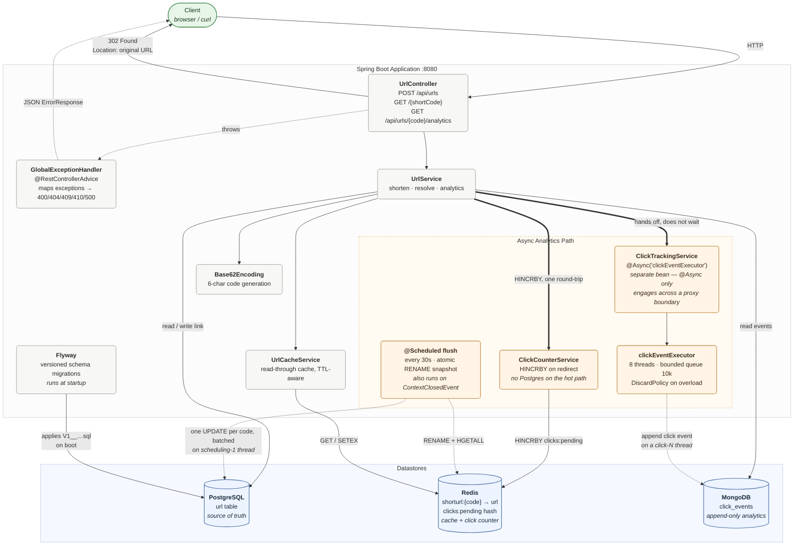
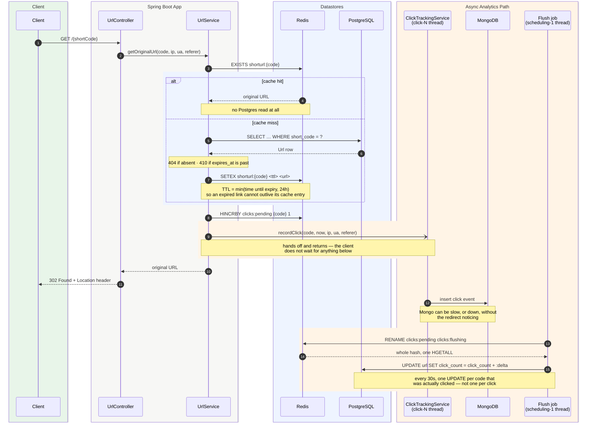
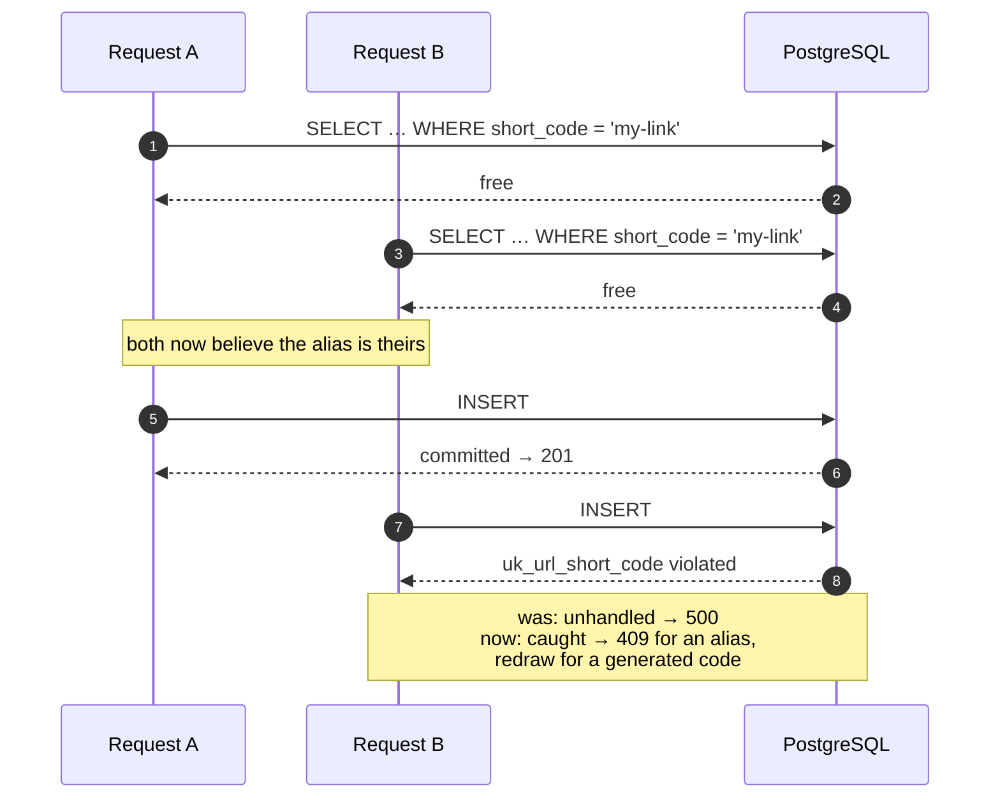

# URL Shortener

A production-shaped URL shortener built with Spring Boot 4 and Java 21, using three
datastores for three different jobs: **PostgreSQL** for the durable link record,
**Redis** for the read-through cache on the redirect hot path, and **MongoDB** for the
append-only stream of click events.

The interesting part of this project isn't shortening a URL — it's that a redirect is a
read-heavy, latency-sensitive operation with a write side-effect, and the three stores
exist to keep those concerns apart.

```bash
git clone https://github.com/raj-kshitiz/Url_Shortener && cd URLShortener
cp .env.example .env          # edit POSTGRES_PASSWORD
docker compose up --build     # app + Postgres + Mongo + Redis
```

Then `curl -X POST localhost:8080/api/urls -H 'Content-Type: application/json' -d '{"originalUrl":"https://example.com"}'`.

---

## Table of contents

- [Architecture](#architecture)
- [Why three datastores](#why-three-datastores)
- [How a redirect works](#how-a-redirect-works)
- [Benchmarks](#benchmarks)
- [Running it](#running-it)
- [API](#api)
- [Data model](#data-model)
- [Design decisions](#design-decisions)
- [Known limitations](#known-limitations)
- [Roadmap](#roadmap)
- [Project layout](#project-layout)

---

## Architecture



The thick arrows mark the boundary between what the client waits for and what it
doesn't. A redirect touches Redis and nothing else: the click event is handed to a
`click-N` thread, and the counter is a single `HINCRBY` that a background job folds
into Postgres later. Both finish after the `302` has already been sent.

Everything runs from a single `docker compose up`: the application image is built from the
multi-stage `Dockerfile`, and the three datastores come up alongside it with healthchecks,
so the app only starts once they are actually accepting connections.

---

## Why three datastores

This is the question an interviewer will ask, so here is the answer up front.

| Store | What lives there | Why not somewhere else |
|---|---|---|
| **PostgreSQL** | The `url` record: short code, original URL, expiry, click count | The short-code → URL mapping is the one thing that must never be lost or duplicated. It needs a real uniqueness constraint (`uk_url_short_code`), and it needs ACID. |
| **Redis** | `shorturl:{code}` → original URL, TTL-bounded; plus the `clicks:pending` counter hash | The redirect is the hot path and it is overwhelmingly reads of a tiny, immutable value. Serving it from Postgres means a network round-trip plus a B-tree lookup for something that never changes. The click counter lives here too, because 1,000 clicks on one link should be 1,000 in-memory increments and *one* Postgres write, not 1,000 `UPDATE`s to the same row. |
| **MongoDB** | One document per click: timestamp, IP, user agent, referer | Click events are high-volume, append-only, never updated, and schema-loose (geolocation is being added, and the shape will keep changing). Putting them in Postgres means unbounded row growth in the same database that serves the hot path. |

The short version: **one store owns correctness, one owns latency, one owns volume.**

---

## How a redirect works



**What the client actually waits for:** two Redis round-trips on a cache hit, and
nothing else. No Postgres, no Mongo. The click event goes to a bounded thread pool;
the counter is a single `HINCRBY` that the flush job folds into Postgres 30 seconds
later. A Mongo stall no longer shows up as redirect latency, and a Mongo outage no
longer turns a cacheable redirect into a 500.

**Where the cost went:** the counter used to be a synchronous `UPDATE` on every
redirect — 1,000 clicks on one link meant 1,000 writes to the same row. Batching them
in Redis turns that into roughly two writes, and takes Postgres off the hot path
entirely. The trade is that `click_count` in Postgres lags by up to 30 seconds; the
analytics endpoint adds the un-flushed Redis delta back so the API never shows the lag.

---

## Benchmarks

"Took Postgres off the hot path" is a claim, and a claim about latency is worth nothing
without a number next to it. So:

**p99 redirect latency: 101.9 ms → 4.2 ms. Sustained throughput: 754 → 20,919 req/s.**

### Redirect hot path

`GET /{shortCode}`, 50 concurrent clients, 60 seconds, one already-cached short code.

| | Before (`af440c7`) | After (`HEAD`) | |
|---|---:|---:|---|
| Throughput | 754 req/s | **20,919 req/s** | 27.7× |
| Latency p50 | 63.91 ms | **2.23 ms** | 28.7× lower |
| Latency p90 | 79.21 ms | **2.97 ms** | 26.7× lower |
| Latency p95 | 85.95 ms | **3.30 ms** | 26.0× lower |
| Latency p99 | 101.90 ms | **4.22 ms** | 24.1× lower |
| Latency max | 168.51 ms | **17.56 ms** | 9.6× lower |
| Failed requests | 0 | 0 | |

"Before" is the last commit prior to this phase, where a redirect ran a synchronous
Mongo insert *and* an `UPDATE url SET click_count = click_count + 1` inside one
transaction. Fifty clients on one popular link means fifty writers queueing for the same
row — the 64 ms median is mostly that queue, not Postgres being slow. "After" is the
same endpoint once the Mongo write moved to a bounded executor and the counter became an
`HINCRBY`, and its 2.2 ms median is two Redis round-trips plus Spring's request
plumbing.

No analytics were traded away for it. Counting warmup and measurement together, the
"after" build served 1,596,265 redirects and left exactly 1,596,265 documents in
`click_events` and a `click_count` of 1,596,265 once the shutdown flush landed — no
drift in either direction, at 20k redirects a second. The executor's 10,000-deep queue
never filled at that rate, so `DiscardPolicy` never had to drop anything; it is what
makes the drop survivable if it ever does.

### The `addUrl` race

Same harness, pointed at `POST /api/urls`: 1,000 requests over 40 custom aliases, 25
concurrent attempts per alias, so every alias is contested. One request per alias can
legitimately win; the question is what the other 24 are told.

| | Before | After |
|---|---:|---:|
| `201 Created` | 40 | 40 |
| `409 Conflict` | 801 | **960** |
| `500 Internal Server Error` | **159** | **0** |

The 159 fives were the check-then-act window: `existsByShortCode` said the alias was
free, another request took it, and the unique index rejected the insert as an unhandled
error. The winner count is unchanged — the constraint was always doing its job. What
changed is that the loser now gets told it lost.

### Method, and what these numbers are not

```bash
docker compose up -d postgres mongo redis
benchmarks/run.sh target/URLShortener-0.0.1-SNAPSHOT.jar after                    # redirect
benchmarks/run.sh target/URLShortener-0.0.1-SNAPSHOT.jar race-after alias-race.js # the race
```

`benchmarks/run.sh` starts a jar, creates a fresh short code, runs a 20-second warmup
that is thrown away, then measures with [k6](https://k6.io/) and writes the summary to
`benchmarks/results/`. Both builds went through that same script, back to back, against
the same containers, on the same JVM (Corretto 26 on an AMD Ryzen 7 6800H, 16 threads,
14 GB). Logging was pinned to `WARN` with `show-sql=false` for both, because the old
build emits SQL on every redirect and leaving that on would have credited the change
with console I/O it did not earn.

Three caveats, because the number is only worth as much as its method:

- **k6 shares the machine with the app and all three datastores.** The 20,919 req/s is a
  floor bounded by this laptop, not a capacity figure for the service.
- **One hot short code, always a cache hit.** That is deliberate — it is the path the
  change was aimed at. It says nothing about a cache miss, which still reads Postgres.
- **The absolute numbers are this machine's.** The ratio is the portable part.

---

## Running it

### Prerequisites

- **Docker** and **Docker Compose** — that is the whole list for the containerized path.
- For running the app outside Docker: **JDK 21** (the Maven wrapper `./mvnw` is included, so no Maven install needed).

### Option A — everything in Docker (recommended)

```bash
git clone https://github.com/raj-kshitiz/Url_Shortener
cd URLShortener

# 1. Create your local env file. Nothing secret is committed to this repo;
#    .env is gitignored and .env.example is the template.
cp .env.example .env

# 2. Edit .env and set a real POSTGRES_PASSWORD (it ships as `change_me`).
#    POSTGRES_DB / MONGO_DB / POSTGRES_USER can stay as they are.

# 3. Build the app image and start all four services.
docker compose up --build
```

First run takes a couple of minutes while Maven downloads dependencies inside the build
stage; later builds reuse the cached layer. The app is up when the log shows
`Started URLShortenerApplication`.

| Service | Host address | Notes |
|---|---|---|
| Application | `http://localhost:8080` | |
| PostgreSQL | `localhost:5432` | exposed so you can attach DBeaver / IntelliJ |
| MongoDB | `localhost:27017` | |
| Redis | `localhost:6380` | **6380**, not 6379, to avoid clashing with a local Redis |

Useful commands:

```bash
docker compose logs -f app      # follow application logs
docker compose ps               # health status of every service
docker compose down             # stop; named volumes keep your data
docker compose down -v          # stop and wipe the databases
```

### Option B — databases in Docker, app in your IDE

Handy for debugging with breakpoints.

```bash
cp .env.example .env                              # then edit POSTGRES_PASSWORD
docker compose up -d postgres mongo redis         # infra only, no app container

# The app defaults to Redis on 6379, but compose publishes it on 6380,
# so override the port for the local run:
SPRING_DATA_REDIS_PORT=6380 ./mvnw spring-boot:run
```

`application.yml` imports `.env` via `spring.config.import: optional:file:.env[.properties]`,
so `POSTGRES_DB`, `POSTGRES_USER` and `POSTGRES_PASSWORD` resolve automatically for a local
run. The import is `optional:`, which is why the same file also works inside Docker, where
Compose supplies those values as real environment variables instead (and env vars win).

If you set `SPRING_DATA_REDIS_PORT` in your shell profile or run configuration once, you
can drop the prefix from the command.

### Verify it works

```bash
# Shorten a URL
curl -s -X POST http://localhost:8080/api/urls \
  -H 'Content-Type: application/json' \
  -d '{"originalUrl":"https://spring.io/projects/spring-boot"}'
# → {"shortUrl":"http://localhost:8080/3kFq2a","originalUrl":"…","expiresAt":null}

# Follow the redirect (-I shows the 302 without following it)
curl -I http://localhost:8080/3kFq2a
# → HTTP/1.1 302 · Location: https://spring.io/projects/spring-boot

# Read the analytics back
curl -s http://localhost:8080/api/urls/3kFq2a/analytics
```

**Prove the redirect doesn't depend on Mongo.** This is the async change in one command —
kill the analytics database and watch redirects keep serving:

```bash
docker compose stop mongo
curl -I http://localhost:8080/3kFq2a     # still 302, no added latency
docker compose start mongo
```

The click events for that window are gone — that is the deliberate trade, see
[Design decisions](#design-decisions). The redirect never noticed.

You can also confirm the work really left the request thread: application logs run at
`DEBUG`, and `ClickTrackingService` logs the thread it ran on.

```
Recorded click for 3kFq2a on click-1                   ← async, correct
Recorded click for 3kFq2a on http-nio-8080-exec-1      ← would mean the proxy was bypassed
```

**Watch the counter batch up.** Click a link ten times, then look at both stores
before the flush fires:

```bash
for i in $(seq 1 10); do curl -s -o /dev/null http://localhost:8080/3kFq2a; done

docker compose exec redis redis-cli HGETALL clicks:pending
# → 3kFq2a  10                          ← counted in memory

docker compose exec postgres psql -U "$POSTGRES_USER" -d url_shortener \
  -c "select click_count from url where short_code='3kFq2a';"
# → 0                                   ← Postgres hasn't been told yet

curl -s http://localhost:8080/api/urls/3kFq2a/analytics    # totalClicks: 10
```

Within 30 seconds Postgres reads `10` and `clicks:pending` is gone. `totalClicks`
reads `10` the whole time — the endpoint adds the un-flushed delta, so the batching
is invisible from outside.

### Configuration reference

| Variable | Used by | Default | Purpose |
|---|---|---|---|
| `POSTGRES_DB` | app + compose | `url_shortener` | Postgres database name |
| `POSTGRES_USER` | app + compose | — | Postgres user |
| `POSTGRES_PASSWORD` | app + compose | — | Postgres password (**set this**) |
| `MONGO_DB` | app + compose | `url_shortener` | Mongo database name |
| `SPRING_DATA_REDIS_HOST` | app | `localhost` | Redis host |
| `SPRING_DATA_REDIS_PORT` | app | `6379` | Redis port — use `6380` for a local run against Compose |
| `APP_BASE_URL` | app | `http://localhost:8080` | Prefix used to build returned short URLs |

No credential is committed anywhere in this repository. `application.yml` contains only
`${PLACEHOLDER}` references; the values come from `.env` locally and from the environment
in Docker.

---

## API

### `POST /api/urls` — create a short URL

```json
{
  "originalUrl": "https://example.com/some/very/long/path",
  "customAlias": "my-link",
  "expiresAt": "2026-12-31T23:59:59Z"
}
```

`originalUrl` is required and validated as a URL. `customAlias` and `expiresAt` are
optional; without an alias, a 6-character Base62 code is generated.

**`201 Created`**

```json
{
  "shortUrl": "http://localhost:8080/my-link",
  "originalUrl": "https://example.com/some/very/long/path",
  "expiresAt": "2026-12-31T23:59:59Z"
}
```

### `GET /{shortCode}` — redirect

Returns **`302 Found`** with the original URL in the `Location` header. On a cache hit
this touches Redis only — the click event goes to a background thread and the counter is
a Redis increment flushed to Postgres later. Optional `X-Forwarded-For`, `User-Agent` and
`Referer` headers are captured for analytics.

### `GET /api/urls/{shortCode}/analytics`

**`200 OK`**

```json
{
  "shortUrl": "http://localhost:8080/my-link",
  "originalUrl": "https://example.com/some/very/long/path",
  "createdAt": "2026-08-11T10:00:00Z",
  "expiresAt": "2026-12-31T23:59:59Z",
  "totalClicks": 42,
  "clicks": [
    {
      "timestamp": "2026-08-11T10:05:00Z",
      "ipAddress": "203.0.113.7",
      "userAgent": "Mozilla/5.0 …",
      "referer": "https://news.ycombinator.com/"
    }
  ]
}
```

`totalClicks` is the Postgres counter plus whatever is still un-flushed in Redis, so it
is accurate the moment you ask; `clicks` is the per-event detail from Mongo.

### Errors

Every error returns the same `ErrorResponse` shape — `{ status, message, timestamp }` —
from a single `@RestControllerAdvice`, so clients never have to parse two error formats.

| Status | When |
|---|---|
| `400 Bad Request` | Missing or malformed `originalUrl` (bean validation) |
| `404 Not Found` | Unknown short code |
| `409 Conflict` | Requested custom alias is already taken — including when it was taken by a request still in flight ([measured](#the-addurl-race)) |
| `410 Gone` | The link existed but has passed its `expiresAt` |
| `500 Internal Server Error` | Anything unhandled — logged server-side, generic message returned |

---

## Data model

**PostgreSQL — `url`** (created by `V1__create_url_table.sql`, applied by Flyway)

| Column | Type | Notes |
|---|---|---|
| `id` | `BIGINT` identity | primary key |
| `short_code` | `VARCHAR(255)` | `NOT NULL`, unique (`uk_url_short_code`) |
| `original_url` | `VARCHAR(2048)` | `NOT NULL` |
| `custom_alias` | `BOOLEAN` | `NOT NULL` — was the code user-supplied |
| `created_at` | `TIMESTAMPTZ` | set by Hibernate `@CreationTimestamp` |
| `expires_at` | `TIMESTAMPTZ` | nullable — null means never expires |
| `click_count` | `INTEGER` | `NOT NULL`, advanced in batches by the 30s flush, never per click |

Schema changes are versioned SQL files under `src/main/resources/db/migration`, applied by
Flyway on startup. Hibernate runs with `ddl-auto: validate`, so it will refuse to start if
the entity and the migrated schema disagree — it never alters the schema itself.

**MongoDB — `click_events`**

```jsonc
{
  "_id": "…",
  "shortCode": "my-link",     // indexed
  "timestamp": "2026-08-11T10:05:00Z",
  "ip_address": "203.0.113.7",
  "userAgent": "…",
  "referer": "…",
  "location": { "country": null, "city": null }   // geolocation enrichment, in progress
}
```

**Redis**

`shorturl:{shortCode}` → original URL, plain strings, TTL of `min(time until expiry, 24h)`.

---

## Design decisions

**Short codes are random, not sequential.** A counter encoded in Base62 is faster to
generate and guarantees uniqueness for free, but it makes every link enumerable — anyone
can walk the keyspace and read every URL ever shortened. Codes are drawn randomly from
`[62⁵, 62⁶)` so every code is exactly 6 characters, giving ~56 billion possibilities.

**The unique index is the uniqueness check, not `existsByShortCode`.** `addUrl` used to
ask whether a code was free and then insert it. There is no answer to that question that
stays true long enough to act on: between the `SELECT` and the `INSERT`, another request
can take the code, and the loser got a 500 — [159 of them per 1,000 contested
requests](#the-addurl-race).



Only the database can decide this atomically, so it does, and `addUrl`'s job is to
translate the constraint violation into the right answer:

- **a custom alias** the user asked for by name becomes a `409`, the same answer the
  pre-check would have given a moment earlier. It is not retried under a different code —
  the user asked for *that* one, and quietly substituting another would be worse than the
  conflict.
- **a generated code** carries no such expectation, so a collision is not an error to
  report — it is a reason to draw again, bounded at five attempts so an exhausted
  keyspace fails loudly instead of spinning.

The pre-check survives for custom aliases only, and only as an optimisation: it makes the
ordinary "that name is taken" answer cost a `SELECT` rather than a failed `INSERT`. For
generated codes it is gone entirely, which removes a `SELECT` from every create.

The catch is narrow on purpose. `original_url` is `VARCHAR(2048)`, so an over-long URL
also arrives as a `DataIntegrityViolationException`, and reporting that as "alias already
taken" would be a lie — so the handler checks that the violated constraint is
`uk_url_short_code` and rethrows anything else.

**`open-in-view` is off**, which that retry depends on. With OSIV on, every save in a
request shares one `EntityManager`, and JPA says a persistence context is unusable after
a failed flush — the second attempt would run on the wreckage of the first. It was
already unnecessary here (entities never leave the service layer, so nothing lazy is
touched during rendering); the retry is what made it load-bearing.

**Expiry is enforced in two places, deliberately.** Postgres holds `expires_at` and the
lookup checks it. But a cached entry never re-reads Postgres, so the cache TTL is capped at
the link's remaining lifetime — an expired link cannot outlive its cache entry. There is
also a guard against a zero or negative TTL: Redis treats a zero TTL as "store forever",
which would turn an expiry into an immortal entry.

**Click events are recorded asynchronously, and may be dropped on purpose.** The redirect
is the product; the click event is telemetry. `ClickTrackingService` lives in its own bean
rather than being a method on `UrlService`, because `@Async` only engages across a Spring
proxy boundary — a self-invocation would compile, start, and silently run synchronously.
The executor is bounded (8 threads, 10,000-deep queue): an unbounded queue would turn a
slow Mongo into an `OutOfMemoryError`. When that queue fills, the policy is `DiscardPolicy`
— events are dropped rather than the default `AbortPolicy`, which throws back into the
calling thread and would return **500s on redirects** because an analytics write couldn't
be queued. `CallerRunsPolicy` would be honest backpressure, but applied to the wrong path:
it makes the request thread do the Mongo write exactly when the system is already
struggling. So the failure mode is chosen: **lose analytics, keep serving redirects.** That
is correct here and would be wrong for anything billable, where the answer is an outbox
table or a broker.

**`@Transactional` moved from the service to the repository.** It used to sit on
`getOriginalUrl`, where it implied the Postgres update and the Mongo insert committed
together. They never did — Mongo isn't a JDBC resource and takes no part in a JDBC
transaction. With the Mongo write now async, the annotation had nothing left to describe,
so it moved down onto the `@Modifying` counter update, which genuinely requires a
transaction. The write got its own short transaction, which is all it ever actually was.

**The click counter is one Redis Hash, not one key per code.** `INCR clicks:{code}` is
the obvious design, and it leaves the flush job unable to answer "which links changed?"
without `KEYS clicks:*` (blocks the server) or `SCAN` plus a read per key. A single
`clicks:pending` hash makes the hot path `HINCRBY` and the flush a single `HGETALL`.

**The flush snapshots with `RENAME`, because `HGETALL` + `DEL` loses clicks.** Any
increment landing between the read and the delete is destroyed by the delete. `RENAME`
is atomic: the instant it returns, `clicks:pending` no longer exists, and clicks
arriving during the Postgres write go into a fresh hash and are picked up next cycle.
If the Postgres write fails, `clicks:flushing` is deliberately *not* deleted and the
next cycle retries it — so a failure double-counts rather than loses, which is the
right direction for a click counter.

**The shutdown flush is a `ContextClosedEvent` listener, not `@PreDestroy`.** This one
is only learnable by testing it. Spring closes a context by publishing
`ContextClosedEvent`, then stopping every `Lifecycle` bean, then destroying beans —
and `LettuceConnectionFactory` is a `SmartLifecycle`, so a `@PreDestroy` flush finds
Redis already stopped and dies with `LettuceConnectionFactory has been STOPPED`. The
counts sit in Redis until the next boot, and nothing in the happy path reveals it.
Listening for the event runs the flush while both Redis and the datasource are open.

**Analytics adds back what hasn't been flushed.** `click_count` in Postgres lags by up
to 30 seconds, so `getAnalytics` returns `click_count + pendingFor(code)`. Without it,
clicking a link and immediately checking analytics reports zero — a batching decision
leaking into the API as what looks like a bug.

**Flyway instead of `ddl-auto: update`.** Hibernate's auto-DDL silently mutates the schema
on startup, which is fine on a laptop and unacceptable anywhere else — there is no review,
no rollback, and no record of what changed. Migrations are versioned SQL, and
`ddl-auto: validate` turns a schema drift into a startup failure instead of a runtime
surprise.

**The Docker image is multi-stage and layered.** The build stage carries a full JDK and
Maven; the runtime stage is a JRE only — no compiler, no build tool, no source. The Spring
Boot fat jar is extracted into layers so that changing a single class doesn't invalidate
the dependency layer. The container runs as a non-root `spring` user, and the JVM sizes its
heap from the container's memory limit (`-XX:MaxRAMPercentage=75`) rather than the host's
total RAM.

**Compose has healthchecks, not `sleep`.** The app's `depends_on` waits on
`condition: service_healthy`, so it starts when Postgres actually accepts connections
rather than when its container merely exists. Data lives in named volumes, so
`docker compose down` doesn't wipe the databases. The app's `stop_grace_period` is raised
to 30s because the default 10s would `SIGKILL` the JVM while the click-event queue was
still draining its 20s termination window.

---

## Known limitations

Stated plainly, because they are the roadmap.

- **Click counts can be lost, and can be double-counted.** Redis is AOF-persisted and the
  app flushes on shutdown, so a graceful stop is safe. A `kill -9` of Redis loses up to 30
  seconds of counts; a failed flush retries the same snapshot and may count it twice. Both
  are acceptable for a click counter and would be wrong for anything billable.
- **Analytics can dip for the duration of a flush.** Between the `RENAME` and the Postgres
  commit, those counts are in `clicks:flushing` — no longer visible to `pendingFor`, not yet
  in `click_count`. The window is milliseconds, and closing it means having analytics read
  both keys.
- **Click events can be lost.** By design (see above), but worth stating plainly: on a hard
  kill (`kill -9`, OOM) in-flight and queued events are gone, and during a sustained Mongo
  outage they are discarded. A graceful shutdown drains the queue within 20s.
- **Redis is now load-bearing for counting, not just caching.** It was already required for
  the redirect path, so this adds no new dependency — but it raises the stakes on the
  phase-3 circuit breaker.
- **An over-long `originalUrl` returns 500, not 400.** The column is `VARCHAR(2048)` and
  nothing validates the length before the insert, so the database rejects it and the
  generic handler turns that into a 500. It is at least honestly a 500 now rather than a
  mislabelled 409, but the fix is a `@Size(max = 2048)` on the request.
- **A missing short code hits Postgres every time.** There is no negative caching, so a
  flood of requests for nonexistent codes passes straight through the cache.
- **No rate limiting and no authentication.** Anyone can create links, and analytics for
  any code are public.
- **No metrics.** There is no way to see the cache hit ratio, redirect latency, or the
  click-executor's queue depth from outside the process — so a discarded event is currently
  invisible.

---

## Roadmap

| Phase | Work | Status |
|---|---|---|
| **1 — Credible** | Docker Compose for all three stores · credentials moved to env vars · Flyway migrations · this README | ✅ Done |
| **2 — Fix the hot path** | `@Async` click events on a bounded, own-policy executor · misleading `@Transactional` moved to the repository · Redis counter hash with a 30s `@Scheduled` flush to Postgres · `addUrl` race fixed by insert-and-catch · [benchmarked, numbers published](#benchmarks) | ✅ Done |
| **3 — Defensible** | Negative caching for missing codes · Redis token-bucket rate limiting returning `429` · circuit breaker on Redis with a Postgres fallback, demonstrated by killing Redis | Planned |
| **4 — Multi-tenant** | Signup/login with Spring Security and JWT · links get an owner, analytics check ownership, redirects stay public · per-user API keys driving the rate limiter | Planned |
| **5 — Observable** | Actuator + Micrometer + Prometheus + Grafana · dashboards for cache hit ratio, redirect latency and clicks/sec | Planned |

Phase 2 is the one that matters, and it is finished: a cache-hit redirect now touches
Redis and nothing else, which is worth **24× lower p99 latency and 27× the throughput**
on the numbers above, and creating a link no longer returns a 500 when two requests
collide. Phase 3 starts from a measured baseline rather than an assumption — the same
harness re-runs against every change after this one.

---

## Project layout

```
URLShortener/
├── compose.yaml                  # app + Postgres + Mongo + Redis, with healthchecks
├── Dockerfile                    # multi-stage, layered, non-root runtime
├── .env.example                  # template — copy to .env, which is gitignored
├── pom.xml                       # Spring Boot 4.0.6, Java 21
├── benchmarks/                   # run.sh (start jar → warm up → measure → stop),
│   ├── redirect.js               #   k6 load profile for GET /{shortCode}
│   ├── alias-race.js             #   k6 script that contests one alias from many VUs
│   └── results/                  #   committed k6 summaries behind the README numbers
└── src/main/
    ├── java/com/example/urlshortener/
    │   ├── controller/           # UrlController — the three endpoints
    │   ├── service/              # UrlService (orchestration), UrlCacheService (Redis),
    │   │                         #   ClickTrackingService (@Async Mongo write),
    │   │                         #   ClickCounterService (Redis counter + @Scheduled flush)
    │   ├── repository/           # UrlRepository (JPA), ClickEventsRepository (Mongo)
    │   ├── model/                # Url (JPA entity), ClickEvents (Mongo document)
    │   ├── dto/                  # request/response records — entities never leave the service
    │   ├── exceptions/           # domain exceptions + GlobalExceptionHandler
    │   ├── config/               # RedisConfig (serializers),
    │   │                         #   AsyncConfig (executor + @EnableAsync + @EnableScheduling)
    │   └── utilities/            # Base62Encoding
    └── resources/
        ├── application.yml       # env-var placeholders only, no secrets
        └── db/migration/         # Flyway versioned SQL
```

**Tech:** Java 21 · Spring Boot 4.0.6 (Web MVC, Data JPA, Data MongoDB, Data Redis,
Validation, Cache) · PostgreSQL 17 · MongoDB 8 · Redis 8 · Flyway · Lombok · Docker Compose
